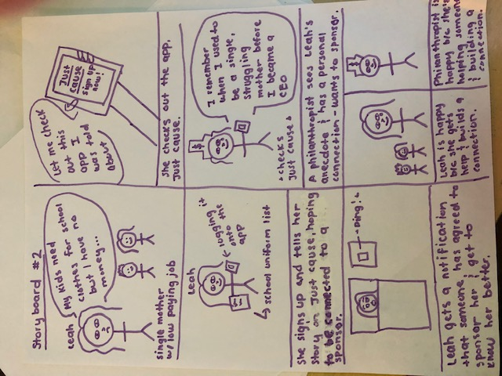
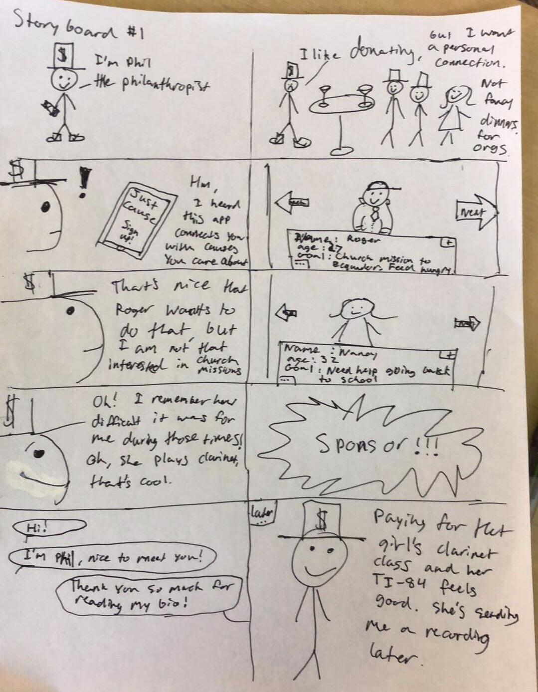
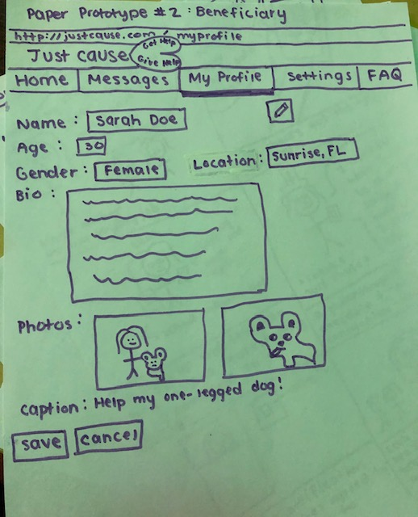
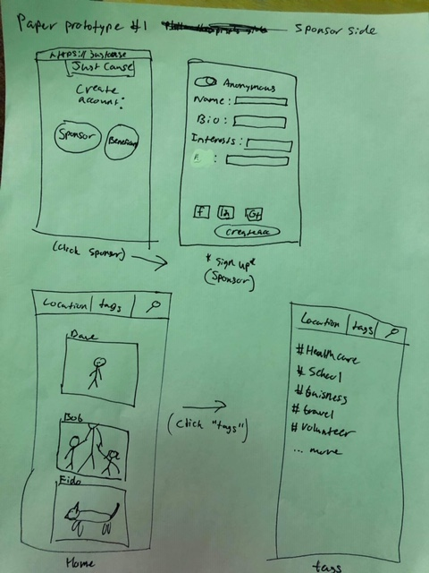

COGS 121 Milestone 1
Team name: !!! (Pronounced Bang Bang Bang)
Members: Rubaiat Tazim, Warren Chen, Will Knox

Our app’s target population are philanthropists and the less fortunate. This fits the project’s theme because the members of our team are neither very wealthy philanthropists nor fall under the category of those in poverty. This app, Just Cause, will attempt to eliminate the middleman in charity organizations, allowing philanthropists to directly help those in need, forming a human and personal connection, as well as see their influence first hand. We could use Facebook API or LinkedIn API for user data.

Storyboards:

Paper Prototypes:

