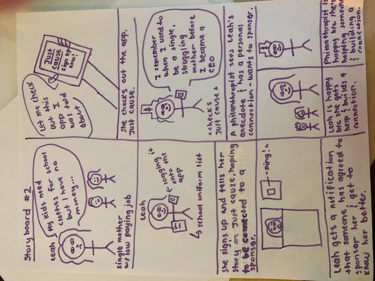
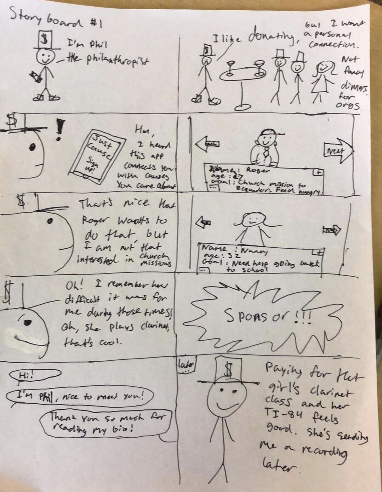
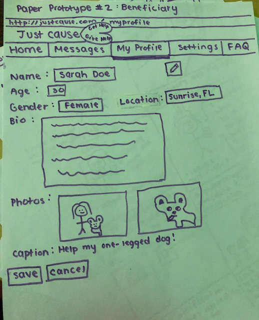
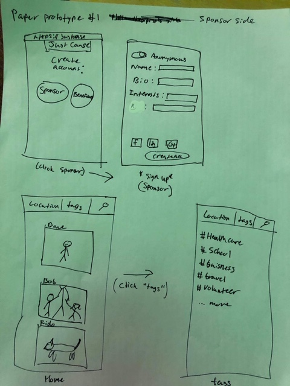

COGS 121 Milestone 1
Team name: !!! (Pronounced Bang Bang Bang)
Members: Rubaiat Tazim, Warren Chen, Will Knox

Our app’s target population are philanthropists and the less fortunate. This fits the project’s theme because the members of our team are neither very wealthy philanthropists nor fall under the category of those in poverty. This app, Just Cause, will attempt to eliminate the middleman in charity organizations, allowing philanthropists to directly help those in need, forming a human and personal connection, as well as see their influence first hand. If a generous philanthropist wants to personally connect with someone in need without doing it though an organization, they could go on the app and look through beneficiaries to find one whose cause they want to contribute to. A person in need could post about something they need sponsored, and give personal anecdotes about why it means a lot for them to receive money for it. From there, the philanthropist and beneficiary could develop a connection; the former can directly see the effects of them helping someone in need, while the latter receives help for something they really need while also developing a connection. We could use Facebook API or LinkedIn API for user data.

Storyboards:

Paper Prototypes:

