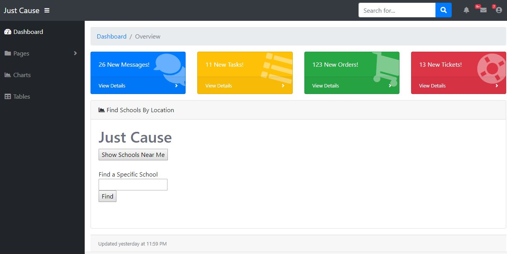

Written Explanation:

	Our UI has been completely redone using a bootstrap theme we found to be thematically relevant to our concept. Additionally, there's a lot more place for new functionalities which we have not yet implemented, but now have the framework to do so later in the project. We added an API call to one of the buttons that dynamically loads a map object on click, and are working on loading a list of markers that show up on said map object using an AJAX call.
