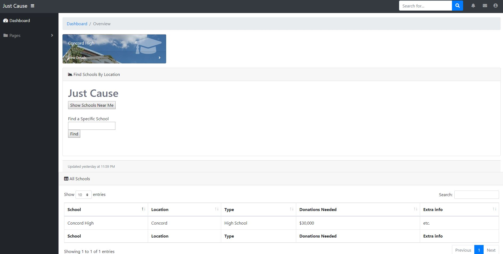
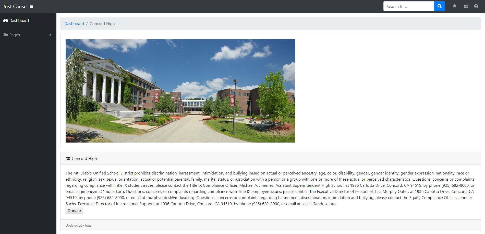
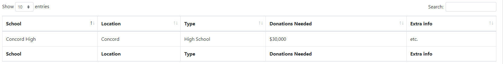

"milestone5.md contains a paragraph describing how someone in your target user population would use your app in order to help them achieve relevant goals. Think of this as a storyboard (setting+sequence+satisfaction) except written in a paragraph instead of using drawings.""

	There are two essential candidates for target users: schools, and donors. 
	For a school user: The user would identify an area of necessity for donation. They would log onto our app, register their shool and list any areas in which the school is looking for donations (supplies, trips, general, etc). After registering the school, they would show up as a potential candidate for donation, and a page about their school would be created within the app. Donors can then access the school here, and donate directly to the school.
	For a donor: registering is a simple task. Once an account is created as a donor, they may search schools nearby or search a specific school, which would return a link to a page in which they can see the schools donation goals, and choose to donate to whichever fund they desire. If the school has not been registered, they can contact the school and request they register.

"milestone5.md contains screenshots of your latest UI webpages embedded directly within the file.""

Screen Shots: 

"milestone5.md contains a written explanation of how your UI's screenshots have improved upon the versions shown in milestone4.md."

	Our register page is now functional, adding to a database of users, and our home page, both which have been simplified in looks and functionality. 

"milestone5.md contains screenshots of how your data is displayed or visualized within your app. Include these as separate screenshots in addition to the general UI screenshots in rubric item 2. (You don't need a fancy visualization, but your data needs to be shown in a way that makes sense for your app.)"

Screen Shots:

"milestone5.md contains a written explanation of how you implemented your data display or visualizations, such as which libraries/frameworks you used (if any), how you hooked up to data APIs or databases, etc. (Again, you don't need a fancy visualization, but your data needs to be shown in a way that makes sense for your app.)"

	Warren pls

"milestone5.md contains a paragraph describing some more ambitious data display or visualization ideas beyond what you've implemented that would make your app more polished. Note that you do NOT need to implement those ideas, so feel free to be more creative here."

	We haven't implemented the actual donation function (obviously), and if we were to fully complete this we would have more specific information on individual schools' needs. Additionally, more information regarding donations would be added if a real donation function was impemented. We could keep track of schools near the user that specifically require more donation, or have notifications for when a nearby school lists a new donation goal, updatable by the school registee. This could encourage users to be more active within the app, and with donating. Schools could also send notifications when a goal has been completed, notifying and thanking those who helped achieve the goal. Donors could choose whether or not to donate publicly, and if chosen publicly, user stats could be posted on a leaderboard-esque page for their local area.