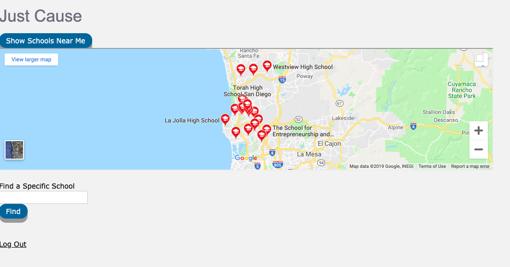
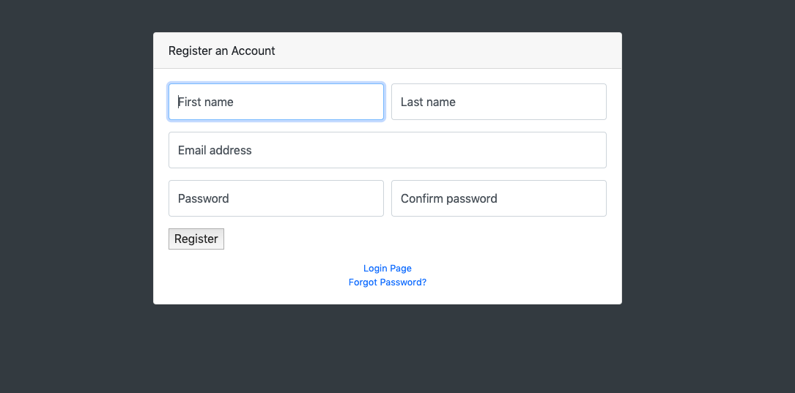

"milestone5.md contains a paragraph describing how someone in your target user population would use your app in order to help them achieve relevant goals. Think of this as a storyboard (setting+sequence+satisfaction) except written in a paragraph instead of using drawings. (2 points)
milestone5.md contains screenshots of your latest UI webpages embedded directly within the file."

	There are two essential candidates for target users: schools, and donors. 
	For a school user: The user would identify an area of necessity for donation. They would log onto our app, register their shool and list any areas in which the school is looking for donations (supplies, trips, general, etc). After registering the school, they would show up as a potential candidate for donation, and a page about their school would be created within the app. Donors can then access the school here, and donate directly to the school.
	For a donor: registering is a simple task. Once an account is created as a donor, they may search schools nearby or search a specific school, which would return a link to a page in which they can see the schools donation goals, and choose to donate to whichever fund they desire. If the school has not been registered, they can contact the school and request they register.

"milestone5.md contains a written explanation of how your UI's screenshots have improved upon the versions shown in milestone4.md."

	Our register page is now functional, adding to a database of users, and our home page 